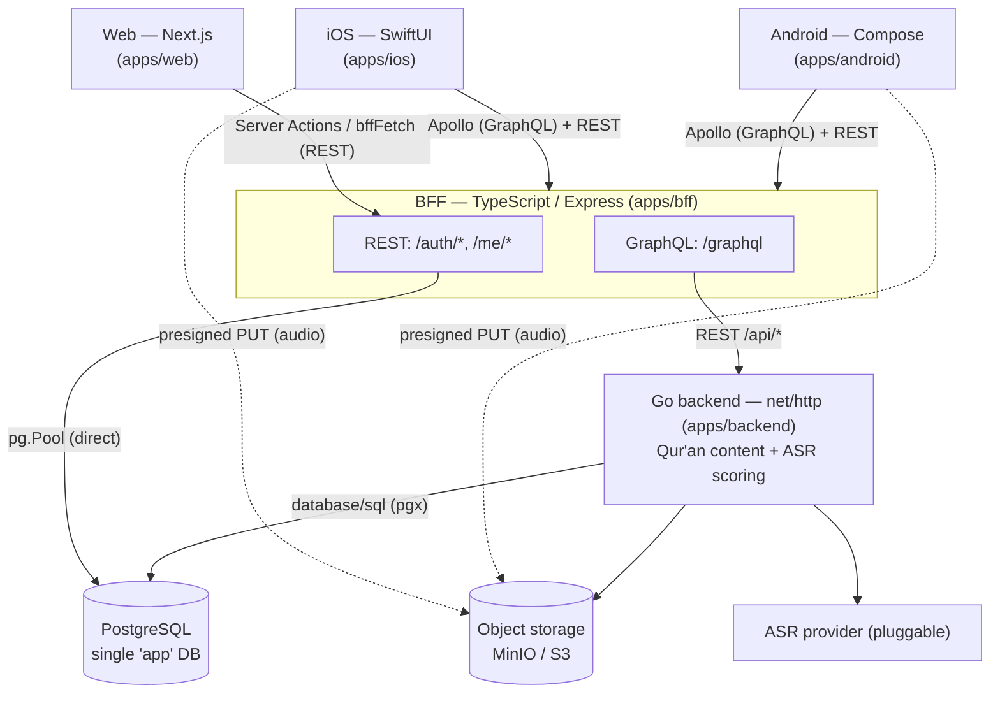

# Architecture Overview

> Describes the current Tilawah system as of 2026-06-22. This is a **descriptive**
> document (what the system _is_), not a decision record. The reasoning behind
> individual decisions lives in `docs/adr/`; this page links to the relevant ADRs.

## 1. Summary

Tilawah is a Qur'an recitation-practice app with three clients (web, iOS, Android),
a single shared edge service ("BFF"), a Go content/scoring backend, one PostgreSQL
database, and an object store for audio. The split is **polyglot by workload**:
TypeScript handles the web-facing edge, auth, and per-user account state; Go handles
the latency-sensitive Qur'an-content and ASR-scoring work.

All three clients enter through the **BFF** — it is the single ingress. The Go
backend is not called directly by clients; the BFF reaches it for Qur'an content and
scoring. Audio bytes bypass both services and are uploaded straight to object storage
via a presigned URL.

## 2. Component diagram

## 3. Components

| Component      | Path            | Stack                                                  | Responsibility                                                                                                                                                                                                                                               |
| -------------- | --------------- | ------------------------------------------------------ | ------------------------------------------------------------------------------------------------------------------------------------------------------------------------------------------------------------------------------------------------------------ |
| Web            | `apps/web`      | Next.js (App Router), Panda CSS, next-intl             | Web UI. Talks to the BFF via Server Actions + `bffFetch` (REST). Keeps `localStorage` as a read-only first-paint cache (ADR 0011).                                                                                                                           |
| iOS            | `apps/ios`      | SwiftUI, Apollo                                        | Native iOS. GraphQL (Apollo) for content + REST for `/auth/*` and `/me/*`. Local-first history (ADR 0007).                                                                                                                                                   |
| Android        | `apps/android`  | Jetpack Compose, Apollo, OkHttp                        | Native Android. Same surface as iOS; base URL is `BuildConfig.BFF_BASE_URL`.                                                                                                                                                                                 |
| **BFF**        | `apps/bff`      | TypeScript, Express, Zod, Apollo Server                | Single ingress for all clients. Owns auth/session, account/profile, and per-user web state. Exposes **REST** (`/auth/*`, `/me/*`) and **GraphQL** (`/graphql`). Writes its tables directly via `pg.Pool`; resolves GraphQL by calling the Go backend's REST. |
| **Go backend** | `apps/backend`  | Go, `net/http` (`http.ServeMux`), `database/sql` (pgx) | Qur'an content (`/api/surahs`, …) and the ASR scoring pipeline. Accesses its tables directly. Calls a pluggable ASR provider (ADR 0013, inline per ADR 0019).                                                                                                |
| PostgreSQL     | `db/migrations` | golang-migrate (ADR 0012)                              | Single `app` database shared by the BFF and the backend (see §5).                                                                                                                                                                                            |
| Object storage | —               | MinIO (dev) / S3                                       | Stores uploaded recitation audio. Clients upload via presigned PUT.                                                                                                                                                                                          |

## 4. Client → BFF protocols

- **Web → REST.** Next.js Server Actions call the BFF through `bffFetch`
  (`apps/web/app/lib/bff-fetch.ts`), which attaches the access token from an
  HttpOnly cookie and refreshes on 401.
- **iOS / Android → GraphQL + REST.** Mobile uses Apollo against `{BFF}/graphql`
  for content/queries, and REST for `/auth/*` (login/signup/refresh) and `/me/*`
  (last-practiced, best-scores, attempts, suggestions, profile).
- **Audio → object storage (direct).** Recording audio is uploaded with a
  presigned PUT straight to object storage, not proxied through the BFF or backend.

## 5. Data ownership

Both services share **one** PostgreSQL database (`postgres://app:app@…/app`,
single role). Table ownership is partitioned **by convention**, made explicit in
ADR 0011 (the web's per-attempt history was deliberately kept in a new
`practice_attempts` table rather than the backend's `attempts`, to avoid coupling
two unrelated write lifecycles).

| Owner          | Tables                                                                                                            | Domain                                    |
| -------------- | ----------------------------------------------------------------------------------------------------------------- | ----------------------------------------- |
| **BFF**        | `users`, `refresh_tokens`, `last_practiced`, `best_scores`, `practice_attempts`, `user_preferences`               | Auth, account/profile, per-user web state |
| **Go backend** | `surahs`, `ayahs`, `attempts`, `segment_scores`, `alignments`, `scoring_jobs`, `asr_results`, `user_data_objects` | Qur'an content, ASR scoring, audio assets |

> The boundary is enforced only by convention today: one DB instance, one role
> (`app`), one shared `db/migrations` folder. There is no schema/role isolation
> between the two services.

## 6. Key flows

1. **Auth / account.** Client → BFF (`/auth/*`, `/me`) → BFF writes `users` /
   `refresh_tokens` directly. The Go backend is not involved.
2. **Per-user web state.** Client → BFF (`/me/last-practiced`, `/me/best-scores`,
   `/me/attempts`, `/me/preferences`) → BFF Postgres tables. `localStorage` (web)
   serves the cached value first; the BFF is the source of truth (ADR 0011).
3. **Qur'an content.** Web → BFF REST → Go backend `/api/*`. Mobile → BFF GraphQL
   → Go backend. Trace context is propagated end-to-end (ADR 0016).
4. **Record → score.** Client uploads audio (presigned PUT) → a `scoring_jobs` row
   is created → the backend runs ASR (ADR 0019) → `asr_results` / score → the
   client reads the result (web: result page; mobile: poll/subscribe).

## 7. Cross-cutting concerns

- **Auth.** Email/password (ADR 0010 `0010-auth-email-password`), JWT access +
  rotating refresh tokens; `requireAuth(req,res)` yields `session.id`. Owned by the
  BFF. `MOCK_SESSION=true` provides a fixed user in dev/CI.
- **Account model.** Account-required, multi-device history (ADR 0021).
- **Telemetry.** OpenTelemetry across services; trace propagation from web → BFF →
  backend (ADR 0016 / 0019-web-vitals).
- **i18n.** Web and clients are internationalized from day one (ADR 0023 / 0009);
  Arabic message files structurally mirror English.
- **Deployment.** GCP Cloud Run (ADR `0010-gcp-cloud-run-deployment`), no Kubernetes
  (ADR 0001), cloud-portability principle (ADR `0011-cloud-portability-principle`).

## 8. Known boundaries & trade-offs

- The "BFF" is the single ingress for **all** clients (web + mobile), so it is closer
  to a **shared API gateway** than a per-frontend BFF. It also owns a database and is
  therefore the system of record for the account/web-state domain — i.e. it combines
  an **edge** role and a **domain/persistence** role.
- The BFF and the Go backend **share one database and one role**; ownership is by
  convention, not enforced. This is a deliberate, documented trade-off (ADR 0011),
  appropriate for the current single-team scale. Reconsideration triggers for
  evolving this boundary are listed in ADR 0011 (§ Reconsideration Triggers).

## 9. Not yet confirmed

- The web client's audio-upload path (whether it also uses a presigned PUT, like the
  mobile clients, or posts through a service) is not verified here.
- Exact mapping of GraphQL resolvers (`apps/bff/src/graphql/resolvers.ts`) to backend
  REST endpoints vs. direct DB reads.

## 10. References

- `docs/adr/0011-bff-persistence-and-localstorage-cache.md` — BFF persistence + cache
- `docs/adr/0021-account-required-multi-device-history.md` — account model
- `docs/adr/0010-auth-email-password.md` — auth
- `docs/adr/0012-database-migrations-with-golang-migrate.md` — migrations
- `docs/adr/0013-pluggable-asr-backend.md`, `docs/adr/0019-backend-inline-asr-supersedes-worker.md` — ASR
- `docs/adr/0016-browser-otel-telemetry-boundary.md` — telemetry boundary
- `docs/adr/0010-gcp-cloud-run-deployment.md`, `docs/adr/0001-skip-kubernetes.md` — deployment
