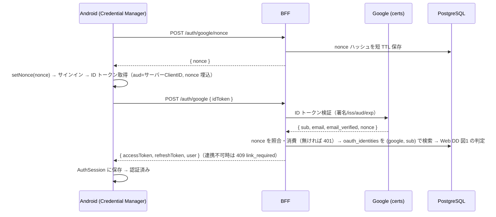

# DD: Google サインイン（ネイティブ・Android 先行）

- **Author**: motoshi.suzuki
- **Reviewers**: TBD
- **Last Updated**: 2026年6月23日
- **Status**: Draft
- **Project**: quran-project / Tilawah 認証

## 1. 背景

本 DD は、Web で実装済みの Google サインイン（[PRD](./google-sign-in-web-1-prd.md) / [DD](./google-sign-in-web-2-dd.md)）を、ネイティブアプリへ広げる。PRD の「今後扱う範囲」が iOS / Android ネイティブを別 DD に委ねており、本 DD がそれを受ける。Why（登録摩擦の低減）は Web PRD と同一で、対象がモバイルに変わるだけである。

一つの問いに還元すると次になる。**Web の BFF・アカウント基盤（`/auth/google`、`oauth_identities`、連携ポリシー）を保ったまま、ネイティブ SDK の認証結果をどう接続するか。**

前提とする決定:

- Web DD の Q3（`oauth_identities` を `sub` キーで保持）・Q4（両側検証済みのみ自動リンク）・Q5（既存 JWT 発行とレスポンス形の再利用）。これらはプラットフォーム非依存で、ネイティブでもそのまま使う。
- Web DD の Q2 は認可コードを交換して ID トークンを得る経路だった。ネイティブはこれと前提が異なる（後述）。

スコープは **Android 先行**。iOS は同じ BFF 契約に乗るため、本 DD の Android 実装後に最小差分で追従する（第 7 章）。

## 2. 概要

ネイティブ SDK は **ID トークンを直接返す**（Android の Credential Manager、iOS の GoogleSignIn SDK）。よって BFF `/auth/google` を **`{ code }`（Web）と `{ idToken }`（ネイティブ）の両対応**にし、ネイティブから来た ID トークンは交換せず直接検証する。検証の `aud` は **サーバー（Web）Client ID** に統一し、各ネイティブ SDK には `serverClientId` としてその ID を渡す。リプレイ防止として **BFF 発行の使い捨て nonce** を SDK に渡し、ID トークンの `nonce` クレームをサーバー側で照合・消費する。これにより BFF は単一の audience で全プラットフォームを検証でき、検証後は既存のアカウント解決・連携・セッション発行をそのまま通る。

本 DD は、Web DD の要件 R1–R3 / N1 / N2 を Android に適用し、ネイティブ ID トークン経路に固有の N3 を加える。

| 番号 | 要件                                                                            | 由来               |
| ---- | ------------------------------------------------------------------------------- | ------------------ |
| R1   | Android で Google サインアップ・サインインでき、email+password と同一セッション | Web PRD Step 1     |
| N1   | アカウント連携は本人性を確認できる範囲でのみ行う                                | Web PRD N1         |
| N2   | 既存の BFF・アカウント・セッション基盤を、契約拡張のみで再利用する              | Web DD N2 の踏襲   |
| N3   | ネイティブ ID トークンのリプレイを防ぐ                                          | ベストプラクティス |

R2（同等永続化）・R3（運用監視ログ）はサーバー側で実装済みで、ネイティブ追加による変更はない。

| 論点 | 設計課題                                         | 対応する要件 |
| ---- | ------------------------------------------------ | ------------ |
| Q1   | ネイティブ認証情報の種類と BFF 契約              | R1, N2       |
| Q2   | ID トークンの audience と GCP クライアント構成   | R1, N1       |
| Q3   | nonce によるリプレイ防止                         | N3           |
| Q4   | Android 実装（Credential Manager）               | R1           |
| Q5   | セッション接続（Android 既存 auth 配線の再利用） | R1, N2       |

## 3. 詳細設計

### Q1: ネイティブ認証情報の種類と BFF 契約

**アプローチ**: R1 をネイティブで満たすには、SDK が返す認証情報を BFF が受けられる必要がある。Web は認可コードだが、ネイティブ SDK が返すものは何か、そして既存エンドポイント（N2）にどう載せるかを決める。

**設計**: Android Credential Manager（`GetGoogleIdOption`）も iOS GoogleSignIn SDK も、**ID トークンを直接返す**。よって `/auth/google` を「`code` か `idToken` のいずれか一方」を受ける契約に拡張する。`idToken` が来たら交換せず直接検証（既存の `verifyGoogleIdToken` を復活）し、`code` が来たら従来どおり交換（`exchangeGoogleCode`）する。どちらも `GoogleIdentity` に正規化し、以降のアカウント解決は共通。

**棄却案とその問題**:

- **ネイティブでもサーバー認可コードを取得して交換に寄せる**。Credential Manager / GoogleSignIn は `serverAuthCode` も取得しうるが、ネイティブのコード交換はリダイレクト URI の扱いが web の `postmessage` と異なり、プラットフォーム別の設定が増える。ネイティブが標準で返すのは ID トークンであり、それを直接検証する方が SDK の素直な使い方で結合が小さい。
- **ネイティブ用に別エンドポイントを新設**（`/auth/google/native`）。アカウント解決・連携・セッション発行が二重化し、N2（基盤の再利用）に反する。`/auth/google` の入力契約を広げるだけで足りる。

**根拠**: R1・N2 を満たす。入力の差（code/idToken）を入口で吸収し、検証済み `GoogleIdentity` 以降は Web と完全に同一経路を通る。

### Q2: ID トークンの audience と GCP クライアント構成

**アプローチ**: R1（正しい本人特定）と N1（安全な連携）は、ネイティブの ID トークンを正しく検証できて初めて成り立つ。検証は `aud` が自分のものであることに依存するため、ネイティブ SDK が発行する ID トークンの `aud` と、BFF が照合する値を一致させる必要がある。

**設計**: ネイティブ SDK の `serverClientId` に **サーバー（Web）Client ID** を渡す。すると SDK が返す ID トークンの `aud` はサーバー Client ID になり、BFF は既存の `GOOGLE_OAUTH_CLIENT_ID`（= サーバー Client ID）で検証できる。GCP には、SDK を動かすためのプラットフォーム別クライアントを別途作る:

- **Android OAuth クライアント**: パッケージ名 ＋ 署名証明書の SHA-1（debug と release の両方）。
- **iOS OAuth クライアント**: bundle ID（iOS 着手時）。

これらネイティブクライアントは SDK の動作に必要だが、**ID トークンの `aud` はサーバー Client ID** になるため、BFF の検証は 1 つの audience で済む。

**棄却案とその問題**: ネイティブクライアント ID を audience に使い、BFF が複数 audience を受理する案。検証対象が増え、どのクライアントを信頼するかの管理が分散する。Google 公式が推奨する「サーバー Client ID を audience に統一」する方が、検証面が 1 点に集約される。

**根拠**: R1・N1 を満たし、BFF の検証を単一 audience に保つ。Client Secret はネイティブの ID トークン経路では不要（交換しないため）。

### Q3: nonce によるリプレイ防止

**アプローチ**: N3 を満たす。ネイティブの ID トークンは交換を挟まず直接 BFF に渡るため、万一トークンが捕捉された場合の再送（リプレイ）を防ぐ必要がある。Google は SDK に nonce を渡し ID トークンの `nonce` クレームをサーバーで照合する方式を推奨する。ただし**クライアントが nonce を生成して送り、サーバーがそれと照合するだけでは循環で、リプレイ防止にならない**（攻撃者はトークンと nonce を共に再送できる）。サーバーが独立に知る値に束縛する必要がある。

**設計**: **BFF 発行の使い捨て nonce** を採る。

1. クライアントが `POST /auth/google/nonce` を呼び、BFF が乱数 nonce を生成して**ハッシュを短 TTL（5 分）で保存**し、生の nonce を返す（保存形式は `refresh_tokens` と同じく SHA-256 ハッシュ）。
2. クライアントが SDK（`GetGoogleIdOption.setNonce`）にこの nonce を渡して ID トークンを得る。
3. `POST /auth/google` で ID トークン検証後、`nonce` クレームのハッシュが**未使用・未期限切れのストアに存在するか**を確認し、即座に使用済みにする（消費）。無ければ 401。

`nonce` クレームは公式ライブラリの検証対象外なので、この照合・消費はアプリ側で行う。

**棄却案とその問題**:

- **nonce を入れない**。TLS＋短命トークン＋自前セッションで脅威は小さいが、N3（リプレイ防止）を要件に掲げた以上、構造的機構で満たすべきで、体制・運用頼みにしない。
- **クライアント生成 nonce をサーバーで一致確認するだけ**（Google サンプルの素朴形）。サーバーが独立の記録を持たないため循環し、リプレイ防止の実効がない。

**根拠**: N3 を満たす。サーバー発行・単回消費により、捕捉トークンの再送は「未使用 nonce が無い」で弾ける。コストは nonce 発行エンドポイントと短 TTL ストア（`auth_nonces` テーブル）1 つで、既存の `refresh_tokens` と同じ作法に収まる。

### Q4: Android 実装（Credential Manager）

**アプローチ**: R1 を Android で満たす。サインイン UI と ID トークン取得を、現行 Google 推奨の API で行う。

**設計**: **Credential Manager API** を採用する。戻りユーザーは `GetGoogleIdOption`（`setFilterByAuthorizedAccounts(true)` → 該当なしなら `false` にフォールバック）、明示ボタンは `GetSignInWithGoogleOption`。いずれも `serverClientId` にサーバー Client ID、`setNonce` に Q3 の nonce を設定して `GoogleIdTokenCredential` を取得し、ID トークンを `AuthApi` 経由で `POST /auth/google { idToken }` に送る。サインアウト時は `clearCredentialState()` で次回の暗黙自動選択を防ぐ。サインイン画面（`SignInScreen` / `SignUpScreen`）の既存 OAuth プレースホルダを配線する。

**棄却案とその問題**: 旧 `GoogleSignIn`（Play Services Auth）API は Google が deprecated とし、Credential Manager への移行を案内している。新規実装で旧 API を選ぶ理由はない。

**根拠**: R1 を満たし、Google が現行で推奨する API に乗る。

### Q5: セッション接続（Android 既存 auth 配線の再利用）

**アプローチ**: R1（同一セッション）と N2（基盤再利用）を満たす。Google サインインの結果も、email+password と同じトークン保存・更新経路に乗せる。

**設計**: BFF のレスポンスは既存の成功形 `{ accessToken, refreshToken, user }`（Web と同一）。Android は既存の `AuthApi` に `signInWithGoogle(idToken)` を足し、戻りを既存の `AuthSession`（DataStore 保存）・`BearerAuthInterceptor`・`TokenRefresher` にそのまま流す。409 `link_required` は「パスワードでログインして連携」を促す表示にする（Web と同じ方針）。

**棄却案とその問題**: Google 用に別のトークン保持経路を作る案は、`AuthSession` / リフレッシュ機構を二重持ちし N2 に反する。レスポンス形が共通なので、既存配線に載せれば差分は最小。

**根拠**: R1・N2 を満たす。

## 4. 全体設計

_図1: Android の Google サインイン経路。アカウント判定は Web DD の図1 を共有する。_

## 5. 障害シナリオとエッジケース

| ケース                            | 起きること                | 期待する挙動                         | 残存リスク            |
| --------------------------------- | ------------------------- | ------------------------------------ | --------------------- |
| ID トークン偽造・期限切れ         | BFF 検証失敗              | 401、連携・作成しない                | なし                  |
| `email_verified == false`         | 自動連携経路に乗らない    | 409 link_required → パスワード連携   | 正規ユーザーに 1 手間 |
| ユーザーが SDK ダイアログを閉じる | ID トークン未取得         | 何もしない（サインイン画面に留まる） | なし                  |
| nonce が再送・期限切れ・不一致    | ストアに未使用 nonce 無し | 401、連携・作成しない                | なし                  |
| SHA-1 / package 未登録            | SDK がトークンを返さない  | サインイン不可、エラー表示           | 設定漏れ              |
| Google 到達不可                   | SDK 失敗 or 検証不可      | エラー表示。email+password は無影響  | ログイン不可（一時）  |

## 6. 実装スケジュール

- **Phase 0: GCP**。Android OAuth クライアント（package ＋ debug/release SHA-1。Play App Signing 利用時は Play 管理証明書の SHA-1 も）を作成。サーバー Client ID（既存 Web Client ID）を Android に配布。
- **Phase 1: BFF**。(a) `auth_nonces` テーブルのマイグレーション（ADR 0012）。(b) `POST /auth/google/nonce`（発行・保存）。(c) `/auth/google` を `{ code } | { idToken }` 両対応に拡張し、`verifyGoogleIdToken` を復活、idToken 経路で nonce を照合・消費。単体テスト（idToken 各分岐・nonce 消費/再送）。
- **Phase 2: Android**。Credential Manager 配線（nonce 取得 → `setNonce` → ID トークン）、`AuthApi.signInWithGoogle`、`AuthSession` 接続、409 ハンドリング、ボタン有効化、サインアウト時 `clearCredentialState`。実機確認。

Phase 1 は Web に後方互換（`{ code }` 経路は不変）。

## 7. 将来の拡張

- **iOS ネイティブ Google サインイン**。同じ BFF 契約（`{ idToken }`）に乗る。GoogleSignIn SDK を導入し `serverClientID` にサーバー Client ID を設定、iOS OAuth クライアント（bundle ID）を GCP に追加。きっかけ: Android 実機確認の完了後。
- **Apple サインイン**。Web DD と同じく Apple Developer Program 要件のため別途。`oauth_identities` に `provider='apple'` を足すだけで拡張できる。
