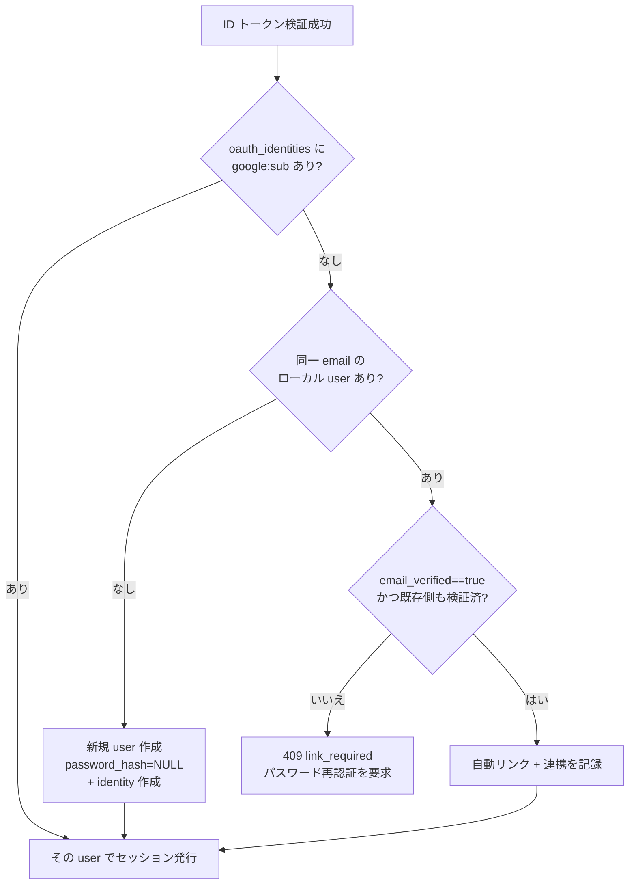
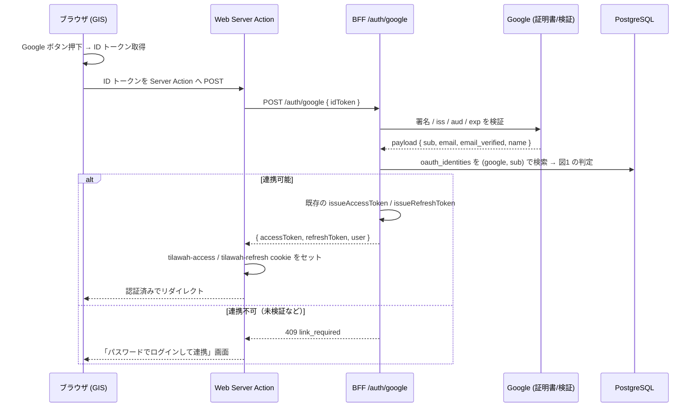

# DD: Google サインイン（Web 先行）

- **Author**: motoshi.suzuki
- **Reviewers**: TBD
- **Last Updated**: 2026年6月23日
- **Status**: Draft
- **Project**: quran-project / Tilawah 認証

## 1. 背景

本 DD は、対になる [PRD: Google サインイン（Web 先行）](./google-sign-in-web-1-prd.md) の要件に答える。広い要請は「Web に Google サインインを追加する」だが、これを一つの問いに還元すると次になる。**既存の自前 JWT セッション基盤を保ったまま、Web でどうやって Google を本人特定の経路として追加するか。**

この問いは、前提とする過去の決定の上に立つ。

- [ADR 0010](../adr/0010-auth-email-password.md): email + password を primary とし、短命のアクセス JWT（`Authorization: Bearer`）と長命のリフレッシュ JWT（HttpOnly cookie）でセッションを構成する。`POST /auth/refresh` のローテーションは実装済み。
- [ADR 0011](../adr/0011-bff-persistence-and-localstorage-cache.md): BFF は `users` と `refresh_tokens` テーブルを持ち、ユーザー状態を `userId` でひも付ける。
- [ADR 0012](../adr/0012-database-migrations-with-golang-migrate.md): スキーマ変更は `golang-migrate` の up/down ペアで行う。

これらの基盤を置き換える選択肢（Clerk / Auth0 / Supabase Auth 等の Hosted SaaS への移行）は、本問いの前提「自前基盤を保つ」に反する。ADR 0010 が pre-revenue での vendor lock-in と月額コストを理由に退けた判断を、Google 1 プロバイダの追加で覆す必然性はない。よって本 DD は基盤移行を検討対象から外し、「既存基盤への追加」だけを解く。

## 2. 概要

Google Identity Services（GIS）の **ID トークン方式**を採用する。ブラウザが Google から ID トークン（本人を表す署名付き JWT）を取得し、Web サーバー経由で BFF の新エンドポイント `POST /auth/google` へ渡す。BFF は Google 公式ライブラリで ID トークンを検証し、`(provider, subject)` をキーとする新テーブル `oauth_identities` でアカウントを特定する。既存アカウントとの連携は、ID トークンの `email_verified` と既存側のメール検証状態が共に成立する場合にのみ自動で行い、それ以外はパスワード再認証を求める。最終的なセッション発行は既存の JWT 発行処理をそのまま呼び、レスポンス形も既存と一致させる。

この方向が必然である理由は、評価軸となる要件にある。本 DD は親 PRD の要件から次を導く。

| 番号 | 要件                                                                                     | 由来                       |
| ---- | ---------------------------------------------------------------------------------------- | -------------------------- |
| R1   | Google でサインアップ・サインインでき、email + password ユーザーと同一のセッションを得る | PRD Step 1                 |
| R2   | パスワードを持たない Google のみユーザーを、既存ユーザーと同等に永続化できる             | PRD Step 2                 |
| R3   | Google サインインの結果を区別して記録し、運用上監視できる                                | PRD Step 3                 |
| N1   | アカウント連携は本人性を確認できる範囲でのみ行う（乗っ取り防止）                         | PRD N1                     |
| N2   | 既存のセッション基盤・cookie 処理を無改修で再利用する                                    | ADR 0010 / 0011 由来の制約 |

各設計論点と要件の対応は次の通りである。

| 論点 | 設計課題                                     | 対応する要件 |
| ---- | -------------------------------------------- | ------------ |
| Q1   | Google 認証フローの選定                      | R1           |
| Q2   | ID トークンの検証                            | R1, N1       |
| Q3   | データモデル（連携の保持とパスワード非存在） | R2           |
| Q4   | アカウント連携ポリシー                       | N1           |
| Q5   | Web 配線とセッション接続                     | R1, N2       |
| Q6   | 運用監視のための記録                         | R3           |

PRD はユーザー体験の時系列順に要件を並べるが、本 DD は設計の依存順に論点を並べる。認証フロー（Q1）と検証（Q2）が下流の前提であり、データモデル（Q3）が決まらないと連携判定（Q4）の書き込み先を具体化できないためである。

## 3. 詳細設計

### Q1: Google 認証フローの選定

**アプローチ**: 解は R1（本人特定とセッション獲得）を満たせばよい。Google API への継続アクセスは要件にない。問うべきは「本人特定だけのために、どのフローが最小の結合で済むか」である。

**設計**: GIS の ID トークン方式を採用する。ブラウザが ID トークンを取得して BFF へ渡すだけで本人特定が完結し、Client Secret もリダイレクト往復も不要である。

**棄却案とその問題**: Authorization Code 方式（リダイレクト型）は、Client Secret の管理、リダイレクト URI の整合、トークン交換エンドポイント、state / nonce の管理を要する。これらが提供するのは Google API への継続アクセス用トークンだが、本機能はそれを使わない。要件にない能力のために結合と運用負荷を負う点で、ADR 0010 の「不要な抽象化を避ける」方針に反する。

**根拠**: R1 を満たし、かつ最小の結合で実現する。Google API 連携が将来要件化したら本判断を再検討する（第7章）。

### Q2: ID トークンの検証

**アプローチ**: ブラウザから渡る ID トークンは、クライアントの主張であって信用できない。R1（正しい本人の特定）と N1（本人性の確認）を満たすには、トークンの真正性を検証し、誰のものかを信頼できる形で確定する必要がある。

**設計**: ID トークンは BFF 側で検証する。Google 公式の `google-auth-library` を用い、署名・発行者（`iss`）・対象者（`aud` が自分の Client ID であること）・有効期限（`exp`）を検証する。検証で取り出すクレームは `sub`（Google の不変な本人 ID）、`email`、`email_verified`、`name` である。検証に失敗した場合はアカウントの特定・作成・連携を一切行わず、認証を拒否する。

**棄却案とその問題**: 自前で JWT を検証する案は、署名アルゴリズムの取り違えや `aud` 未検証といった既知の実装ミスを招きやすく、なりすましの入口になる。公式ライブラリに委譲することでこの種の誤りを避ける。

**根拠**: R1 と N1 を満たす。偽造トークンを排除し、信頼できる `sub` を下流（Q3・Q4）に渡す。

### Q3: データモデル（連携の保持とパスワード非存在）

**アプローチ**: R2（Google のみユーザーを同等に永続化）と、Q4 の連携ポリシーが必要とするデータ表現を満たす。連携のひも付けキーは、変更されうるメールではなく安定識別子 `sub` でなければならない。なお、パスワードを持たない Google のみユーザーの永続化は、`users.password_hash` が既存マイグレーション（`20251202202600_init`）で既に nullable（`NULL = パスワード資格情報なし`）であるため、スキーマ変更を要しない。

**設計**: `(provider, subject)` を一意キーとする新テーブル `oauth_identities` を追加し、Google ID と `user_id` を結ぶ。

```sql
CREATE TABLE oauth_identities (
  id          UUID PRIMARY KEY DEFAULT uuid_generate_v4(),
  user_id     UUID NOT NULL REFERENCES users(id) ON DELETE CASCADE,
  provider    TEXT NOT NULL,              -- 'google'（将来 'apple' 等）
  subject     TEXT NOT NULL,              -- Google の sub（不変の安定 ID）
  email       CITEXT,                     -- 連携時点のメール（監査用。キーには使わない）
  created_at  TIMESTAMPTZ NOT NULL DEFAULT now(),
  UNIQUE (provider, subject)
);
CREATE INDEX idx_oauth_identities_user_id ON oauth_identities(user_id);
```

変更は ADR 0012 に従い up/down ペアのマイグレーション 1 本で行う。`(provider, subject)` の一意制約は、同一 Google ID の二重リンクを DB レベルで防ぐ。Google のみユーザーは `password_hash = NULL` で作成し、user 行と identity 行を 1 トランザクションで挿入する。

**棄却案とその問題**: `users` に `google_sub` 列を直接追加する案は、Apple 等のプロバイダを足すたびに `apple_sub`・`facebook_sub` と列が増え続け、テーブルが疎な列で膨らむ。`oauth_identities` 別テーブルなら、プロバイダ追加は行の追加だけで済む。

**根拠**: R2 を満たし、`sub` をキーに置くことで Q4 の安全な連携を可能にする。

### Q4: アカウント連携ポリシー

**アプローチ**: N1（本人性を確認できる範囲でのみ連携）を満たす。既存の email + password アカウントと同じメールで Google サインインしたとき、メール文字列の一致だけで自動連携すると、pre-account hijacking 攻撃が成立しうる（USENIX Security 2022, Sudhodanan & Paverd）。攻撃者が被害者のメールで先にローカルアカウントを作り、被害者の Google ログインでマージされると、攻撃者の経路が残存する。この攻撃の前提は「連携先のローカルアカウントのメールが未検証であること」であり、本サービスのローカルアカウントは登録時にメール所有を前提に発行されている（PRD のリスクと前提条件）。それでも安全側に倒した判定を設計する。

**設計**: 次の判定で連携する。(1) 内部キーを `sub` に置く。(2) `email_verified == true` と既存側の検証状態が共に成立する場合にのみ自動連携する。(3) 成立しない場合は HTTP 409 `link_required` でパスワード再認証を求める。



_図1: アカウント連携の判定フロー。_

**棄却案とその問題**: 二つの極端な案がいずれも要件に反する。メール一致による無条件自動連携は、未検証メールへの連携を許し、上記の乗っ取りを通す（N1 違反）。逆に連携を一切せず常に新規アカウントを作る案は、同一人物に重複アカウントを生み、練習履歴・スコアを分断する（R2 違反）。両ゲートを置く本設計は、その中間で両要件を満たす。Auth0 / Firebase が採るパスワード再認証方式と同じで、Supabase・Clerk・Stytch も「両側検証済みなら自動連携」を既定とする。

**根拠**: N1 を満たしつつ、正規ユーザーの大多数（Gmail は `email_verified == true`）には追加ステップを課さない。

### Q5: Web 配線とセッション接続

**アプローチ**: R1（同一セッション）と N2（既存基盤の無改修再利用）を満たす。Google ユーザーも最終的に email + password ユーザーと同じトークンと cookie を得る必要がある。

**設計**: Q4 の判定後のセッション発行は、既存の発行処理（`apps/bff/src/auth/credentials.ts` の `issueAccessToken` / `issueRefreshToken`、`refresh-tokens.ts` の発行記録）をそのまま呼ぶ。`POST /auth/google` のレスポンス形は既存の成功形 `{ accessToken, refreshToken, user }` と一致させる。これにより Web 側の cookie 設定（`apps/web/app/lib/auth-cookies.ts` の `tilawah-access` / `tilawah-refresh`）は無改修で再利用でき、アクセストークンは HttpOnly cookie に入り XSS 耐性を保つ。

Web 側は次を配線する。`OAuthButtons.tsx` の無効化を解除し、GIS の認証情報コールバックを接続する。新しい Server Action が ID トークンを `POST /auth/google` へ中継し、成功レスポンスを cookie に格納する。409 `link_required` の場合は「このメールは登録済みです。パスワードでログインすると Google を連携できます」を表示し、既存サインイン画面へ誘導する。文言は i18n の `auth.social.*` 配下に追加する。Apple ボタンは無効のまま据え置く。

**棄却案とその問題**: Google 用に別のトークン形式やセッション経路を新設する案は、N2 に反する。cookie 処理・`requireAuth` ミドルウェア・リフレッシュフローを二重持ちすることになり、保守の結合が増える。レスポンス形を既存に一致させれば、これらは一切変更不要になる。

**根拠**: R1 と N2 を満たす。

### Q6: 運用監視のための記録

**アプローチ**: R3（結果を区別した記録と運用監視）を満たす。利用状況の KPI 計測は目的としない（PRD Step 3）。

**設計**: `POST /auth/google` の分岐を、`docs/telemetry.md` の方針に沿った構造化ログとして記録する。区別する事象は、新規登録（`auth.google.signup`）、既存ログイン（`auth.google.login`）、自動連携成立（`auth.google.linked`）、連携要求（`auth.google.link_required`）である。連携成立の本人通知（メール基盤が整うまでの暫定）も、同じログ上の事象として残す。

**棄却案とその問題**: 単一の「Google サインイン成功」イベントだけを出す案は、新規登録・既存ログイン・連携要求を区別できず、設定ミスや障害の兆候（連携要求の急増など）を監視できない（R3 違反）。

**根拠**: R3 を満たし、運用監視に足る粒度を確保する。

## 4. 全体設計



_図2: Web の Google サインイン経路。判定分岐の詳細は図1（Q4）に従う。_

## 5. 障害シナリオとエッジケース

| ケース                                                     | 起きること                         | 期待する挙動                                              | 残存リスク                              | 将来の緩和                                          |
| ---------------------------------------------------------- | ---------------------------------- | --------------------------------------------------------- | --------------------------------------- | --------------------------------------------------- |
| ID トークン偽造・改ざん                                    | 検証失敗                           | 401、連携・作成しない                                     | なし                                    | —                                                   |
| `email_verified == false`（主に Workspace / 独自ドメイン） | 自動連携経路に乗らない             | 409 link_required → パスワード再認証                      | 正規ユーザーに 1 ステップ増             | パスワード設定済みなら通常ログインで吸収            |
| 同一メールの既存パスワードアカウント                       | 図1 のゲート通過時のみ自動連携     | 通過: 自動連携 + 記録 / 非通過: 409                       | 検証済みは現在の所有を保証しない        | 連携記録 + パスワードリセット時の全セッション無効化 |
| 同一 `sub` の同時リクエスト（競合）                        | `(provider, subject)` 一意制約違反 | 既存 identity に解決しリトライ                            | なし                                    | —                                                   |
| Google が後でメール変更                                    | `sub` 不変のためログイン継続可能   | 影響なし（キーが `sub`）                                  | 監査用 `email` 列が古くなる             | 連携時に `email` を更新                             |
| パスワードリセット発生                                     | 既存フロー                         | 全アクティブセッションと pending email 変更リンクを無効化 | 未対応なら Unexpired-Session 変種が残る | リセット時の一括無効化を確実に実装                  |
| Google 側障害（証明書 / 検証到達不可）                     | 検証不可                           | 5xx でフェイル、セッション発行しない                      | Google ログインのみ不可                 | email + password は独立経路で無影響                 |
| `GOOGLE_OAUTH_CLIENT_ID` 未設定                            | 起動時 / 初回検証で失敗            | Google ボタンを描画しない、または明示エラー               | 設定ミス                                | 起動時の環境変数バリデーション                      |

## 6. 実装スケジュール

各フェーズは独立に検証可能で、前フェーズに依存する。

- **Phase 0: Google Cloud 設定**。OAuth 2.0 Client ID（Web 種別）を発行し、Authorized JavaScript origins を登録、`GOOGLE_OAUTH_CLIENT_ID` を BFF・Web に配布。Client Secret は不要（Q1）。
- **Phase 1: スキーマ**。`oauth_identities` 追加のマイグレーション（up/down ペア、ADR 0012）。`password_hash` は既に nullable のため変更不要。ローカル適用確認。
- **Phase 2: BFF `POST /auth/google`**。ID トークン検証（Q2）+ 連携判定（Q4）+ 既存 JWT 発行への接続（Q5）。単体テスト（検証成功/失敗、各分岐、409）。
- **Phase 3: Web 配線**。GIS ボタン有効化、Server Action、409 ハンドリング、i18n。サインアップ・サインイン両画面で動作確認。
- **Phase 4: 運用監視ログ**。Q6 の構造化ログ。4 事象の発火確認。

Phase 2 と Phase 3 は、`POST /auth/google` のリクエスト/レスポンス契約を先に固めれば並行できる。

## 7. 将来の拡張

各項は、何を先送りするか・なぜか・再検討のきっかけを記す。

- **iOS / Android ネイティブ Google サインイン**。Web で効果検証してから投資判断する。きっかけ: Web の登録率改善が確認でき、モバイル展開の判断が立った時点。`oauth_identities` はそのまま再利用できる。
- **Apple サインイン**。Apple Developer Program 登録と固有要件のため先送り（ADR 0010）。きっかけ: App Store がモバイルで federated を必須化、または iOS ネイティブ対応と同時。`oauth_identities` に `provider='apple'` を足すだけで拡張できる。
- **連携解除 / パスワード追加設定**。`password_hash` が nullable なので後方互換で追加できる。きっかけ: アカウント設定画面の整備時。
- **連携成立通知のメール化**。本スコープでは構造化ログで代替（Q6）。きっかけ: パスワードリセット用のメール基盤（Resend / Postmark / SES 等）の導入時。
- **Google API 連携**。Q1 で ID トークン方式を選び継続アクセス用トークンを取得していない。きっかけ: カレンダー連携等で Google API アクセスが要件化した時点。Authorization Code 方式への切り替えを再検討する。
