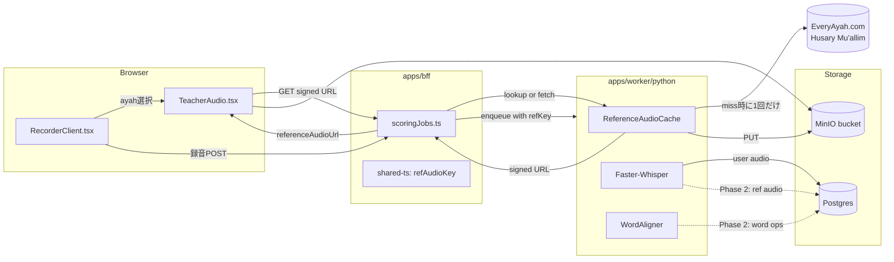
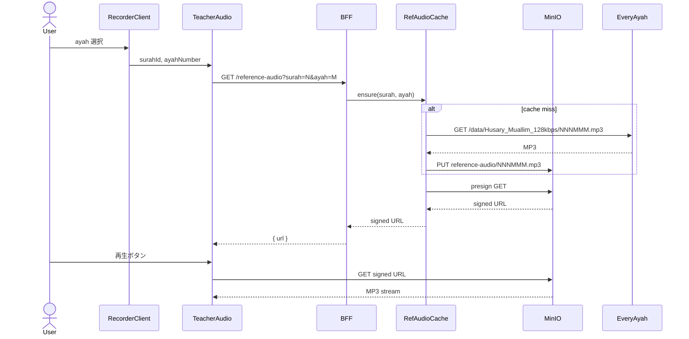
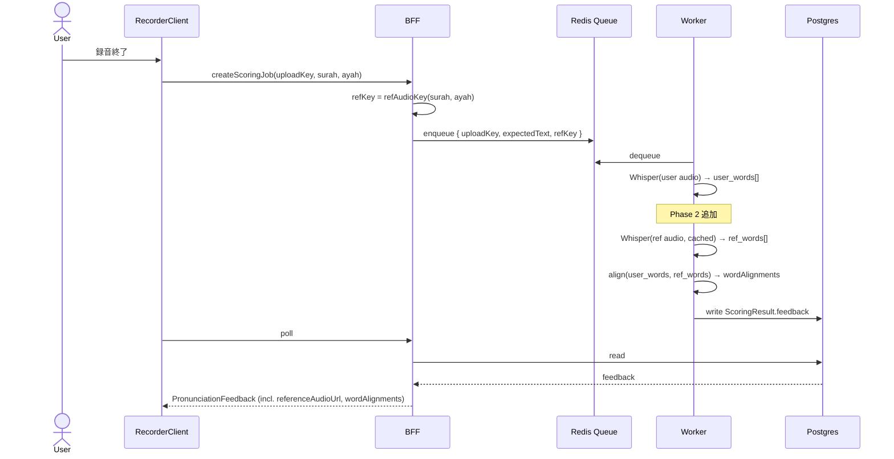

# DD: 模範音声 (Teacher Voice) 配信と語単位発音フィードバック

- **Author**: motoshi.suzuki
- **Reviewer**: TBD
- **Last Updated**: 2026年5月7日
- **Status**: Draft (historical — see note below)
- **Project**: quran-project / web 録音体験向上

> **Note (2026-06-19)**: 本 DD は Python Worker (faster-whisper) 前提で書かれているが、Phase 5 検証 ([docs/free-tier-verification-troubleshooting.md](../free-tier-verification-troubleshooting.md)) で Go backend が Google Cloud Speech-to-Text v2 (chirp_3) を同期呼び出しする経路に切り替わった ([ADR 0019](../adr/0019-backend-inline-asr-supersedes-worker.md))。Worker / Redis / enqueue は削除済み。
>
> 本文の Worker 言及 (`apps/worker/python/main.py` 等) は当時の設計を示す履歴で、現在のコードベースには対応物がない。語単位 alignment / `WordAligner` の責務は `apps/backend/internal/arabic` と `apps/backend/internal/transcribe` に移った。fluency 成分は chirp_3 が word_confidence を返さないため現在 0 固定 (ADR 0019 参照)。

---

## 1. Background

### 1.1 現状の課題

`/record` ページではユーザーがマイクで自身の朗誦を録音し、BFF 経由で MinIO にアップロード、Faster-Whisper を用いた Worker がスコアリングを実行する。スコア結果はブラウザにポーリングで返却される。

しかし、現在のフローには以下の根本的なギャップがある。

| ギャップ                                                  | 影響                                                                                                                    |
| --------------------------------------------------------- | ----------------------------------------------------------------------------------------------------------------------- |
| ユーザーが選択した āyah の **正しい発音を聴く手段がない** | 学習サイクルが成立しない。録音前にお手本がないため、ユーザーは自身の発音の妥当性を判断できない。                        |
| スコアリングが **テキストレベルの WER のみ** に基づく     | 「正しい単語を発した」ことしか評価できず、makharij（調音点）や tajwīd（朗誦規則）といった発音そのものの精度を測れない。 |
| 結果 UI が **語単位の正誤** を可視化していない            | ユーザーはスコア値しか見られず、どの語をどう修正すべきかが分からない。                                                  |

### 1.2 設計目標

本 DD は2つのタスクを **同一データパス上で段階的に実現する** ことを目的とする。

1. **Phase 1（現タスク）**: 選択中の āyah に対する模範音声をブラウザで再生可能にし、同じ模範音声をスコアリングジョブにも引き渡す。
2. **Phase 2（次タスク）**: 模範音声とユーザー音声の語単位アライメントを Worker で算出し、語単位の正誤を UI に可視化する。

> **Phase 1 と Phase 2 の間でデータパスを再設計しない**。これが本設計の中核原則である。Phase 1 で模範音声 URL のプロビジョニングと参照配線を完了させておけば、Phase 2 は純粋に「比較ロジックの追加」となる。

### 1.3 PRD 参照

本機能の正式な PRD は未作成である。要件源泉は以下の対話ログおよび既存スキーマ仕様とする。

- 対話ログ: `docs/dd/teacher-voice-and-pronunciation-feedback.md` 起票時のチャット履歴（要件確定後に PRD を起こす予定）
- 既存スキーマ: `packages/shared-ts/src/graphql/types.generated.ts` の `PronunciationFeedback`, `WordAlignment`, `ScoringResult`
- 既存 Worker 仕様: `apps/worker/python/README.md`

PRD 不在による要件の曖昧さは、Section 9 で「Phase 1 完了後に PRD を起こす」と明記する。

### 1.4 既存資産の棚卸し

調査により、以下の既存資産が **次タスクの 8 割を既に実装済み** であることが判明した。これは本設計の前提条件として重要である。

| 資産                               | 場所                                                | 提供能力                                                                                                                        |
| ---------------------------------- | --------------------------------------------------- | ------------------------------------------------------------------------------------------------------------------------------- |
| `PronunciationFeedback` GraphQL 型 | `packages/shared-ts/src/graphql/types.generated.ts` | `accuracy`, `completeness`, `fluency`, `overall`, `wordAlignments`, `referenceAudioUrl`, `wer`, `transcript` を保持するスロット |
| `WordAlignment` GraphQL 型         | 同上                                                | `{ refWord, hypWord, op }`：WER アラインメント結果（insert/delete/sub）を表現可能                                               |
| `ScoreSegment` GraphQL 型          | 同上                                                | `score`, `metrics: JSONObject`：語単位スコアの拡張用 escape hatch を保持                                                        |
| Faster-Whisper Worker              | `apps/worker/python/main.py`                        | Arabic ASR、語単位タイムスタンプ生成、MinIO 連携、Postgres 書き戻し                                                             |
| MinIO 基盤                         | `ops/docker/compose.dev.yml` の `minio` サービス    | 模範音声キャッシュに転用可能                                                                                                    |

つまり、設計の力点は「新しい仕組みを建てる」ではなく「既存スキーマとパイプラインを **正しく満たす**」ことに置かれる。

---

## 2. Design Considerations

設計に先立ち、以下の考慮事項を明示する。各項目は Section 6 のコンポーネント設計に対応する。

### 2.1 データパス一貫性 (Phase 1 ↔ Phase 2)

**Risk**: Phase 1 で「ブラウザ用 URL」と「Worker 用 URL」を別々に組み立てると、Phase 2 で Worker が模範音声を取得する際に、ブラウザが再生したものと厳密に同一であることを保証できない。これはスコアリングの再現性を損なう。

**Direction**: 模範音声の URL 解決は **shared-ts パッケージの単一関数** に集約し、web / bff / worker から同一実装を参照する。

→ Section 6.1 で実装。

### 2.2 第三者プロバイダー依存リスク

**Risk**: Phase 1 では EveryAyah.com の MP3 を直接参照する。同サイトはコミュニティ運営であり SLA がない。スコアリング中に EveryAyah が応答しない場合、Worker が模範音声を取得できずジョブ失敗を引き起こす。

**Direction**: 第三者依存を許容するのはブラウザ表示のみ。**スコアリングジョブが参照する模範音声は MinIO にキャッシュ済みの URL** を用いる。Worker は EveryAyah を直接叩かない。

→ Section 6.3 で実装。

### 2.3 再現性 (Determinism)

**Risk**: 同一 (surah, ayah) ペアに対するスコアリングは、何度実行しても同一の `referenceAudioUrl` を返すべきである。EveryAyah が同 URL の MP3 を変更した場合、再現性が失われる。

**Direction**: 初回スコアリング時に EveryAyah からダウンロードし、MinIO に **コンテンツアドレス可能なキー**（例: `reference-audio/{surah:03d}{ayah:03d}.mp3`）で保存する。以降は MinIO の signed URL を `referenceAudioUrl` として返す。

→ Section 6.3 で実装。

### 2.4 マイク汚染リスク

**Risk**: ユーザーが録音中に模範音声を再生すると、マイクが模範音声を拾い、スコアリング対象がユーザー音声 + 模範音声の混合となる。WER もアラインメントも汚染される。

**Direction**: ブラウザコンポーネントは「録音開始時に模範音声プレイヤーを必ず一時停止」する制御を組み込む。録音中は再生ボタンを disabled にする。

→ Section 6.4 で実装。

### 2.5 発音評価の妥当性 (Phase 2 中核)

**Risk**: 既存の WER は「ユーザーが正しい単語列を発したか」しか測らない。同じ単語列を makharij なしで発した録音と、tajwīd を完璧に守った録音とで、WER は同値となる。これは Quran 学習者にとっての「正しい発音」を表現していない。

**Direction**: Phase 2 では「語単位の発話有無 + 信頼度」を最低ラインとする。アコースティック比較（MFCC ベースの DTW、phoneme posterior 比較）は Phase 3 以降で段階導入する。

→ Section 6.5, 9 で実装範囲を明示。

### 2.6 段階的成熟度

**Risk**: Phase 1 で完璧を求めるとリリースが遅れ、Phase 2 で要件が膨れると Phase 1 の設計が破綻する。

**Direction**: Phase 1 は「お手本が聴ける」と「Phase 2 が同じデータを使える」の2点に絞る。語単位ハイライトや A/B プレイヤーは Phase 1 のスコープ外とする。

→ Section 8 のスケジュールで実装フェーズを明示。

### 2.7 ストレージコスト

**Risk**: 全 6,236 āyah の MP3 を MinIO にキャッシュする場合、ストレージ容量と初回ダウンロードコストが発生する。

**Direction**: 1 āyah あたり ~50KB（128kbps Mu'allim 想定）として **総容量 ~300MB**。これはローカル開発の MinIO でも本番想定でも無視できる規模であり、コストではなく利益（再現性、可用性、Worker レイテンシ低減）が上回る。**全件キャッシュは on-demand (lazy) 方式** とし、初回スコアリング時にのみ取得する。

→ Section 6.3 で実装。

### 2.8 ブラウザ自動再生制限

**Risk**: モバイルブラウザはユーザー操作を伴わない `<audio>` の自動再生を抑制する。

**Direction**: 模範音声は **常にユーザーがボタンを押した結果として再生** する。auto-play は採用しない。

→ Section 6.4 で実装。

---

## 3. Overall Design

### 3.1 アーキテクチャ全景



_Fig 1. 全体構成。実線は Phase 1 のフロー、点線は Phase 2 で追加されるフロー。_

### 3.2 主要コンポーネント

| コンポーネント                       | 役割                                                                                                     |
| ------------------------------------ | -------------------------------------------------------------------------------------------------------- |
| `TeacherAudio.tsx` (web)             | 選択中の āyah に対する模範音声を `<audio controls>` で再生する。録音中は一時停止する。                   |
| `refAudioKey()` (shared-ts)          | (surahId, ayahNumber) → MinIO オブジェクトキーを返す純関数。web/bff/worker で共有。                      |
| `ReferenceAudioCache` (worker)       | MinIO に該当キーが存在しなければ EveryAyah からダウンロードし保存する。signed URL を返す。               |
| `BFF JobPayload Augmentation`        | スコアリングジョブ作成時に `referenceAudioKey` を payload に含める。                                     |
| `WordAligner` (worker, Phase 2)      | ユーザー音声の Whisper 結果と模範音声の Whisper 結果を語単位でアラインし、`WordAlignment[]` を生成する。 |
| `WordFeedbackOverlay` (web, Phase 2) | スコアリング結果の `wordAlignments` を読み、ayah テキストの語ごとに色分け表示する。                      |

### 3.3 主要フロー

#### 3.3.1 Read path: ユーザーが模範音声を聴く（Phase 1）



_Fig 2. 模範音声配信シーケンス。EveryAyah は cache miss 時のみ叩かれる。_

#### 3.3.2 Score path: 録音 → スコアリング（Phase 1 + Phase 2）



_Fig 3. スコアリングシーケンス。実線が Phase 1 範囲、Note が Phase 2 範囲。_

---

## 4. Alternatives Considered

### 4.1 模範音声の調達方法

| 案                   | Pros                                    | Cons                                           | 棄却/採用                                                 |
| -------------------- | --------------------------------------- | ---------------------------------------------- | --------------------------------------------------------- |
| EveryAyah 直接利用   | 無料、Mu'allim あり、URL がテンプレート | SLA なし                                       | **Phase 1 で採用**（MinIO キャッシュで SLA リスクを吸収） |
| Quran.com API v4     | 語単位タイミングを取得可能              | API 呼び出し必須、JSON parsing                 | **Phase 2 候補**（Whisper 二重ランで代替可能なら不要）    |
| 自社録音             | ブランド整合、品質保証                  | 月単位の制作コスト                             | 棄却                                                      |
| TTS (text-to-speech) | 即時実装可能                            | tajwīd / makharij を表現できず学習目的に反する | 棄却                                                      |

### 4.2 模範音声の配信経路

| 案                                        | Pros                                           | Cons                             | 棄却/採用        |
| ----------------------------------------- | ---------------------------------------------- | -------------------------------- | ---------------- |
| ブラウザから EveryAyah 直接参照           | 最小実装                                       | Worker と URL が乖離、再現性なし | 棄却             |
| BFF が EveryAyah を proxy で stream       | URL 統一、CORS 不問                            | Range request 実装、帯域コスト   | 棄却（過剰実装） |
| **BFF が MinIO キャッシュを介す（採用）** | URL 統一、再現性、Worker から同 URL を参照可能 | キャッシュ実装が必要             | **採用**         |

### 4.3 語単位アライメント手法（Phase 2）

| 案                                                                      | Pros                                                 | Cons                          | 採用判定           |
| ----------------------------------------------------------------------- | ---------------------------------------------------- | ----------------------------- | ------------------ |
| **Whisper 二重ラン + テキストアライメント（採用）**                     | 既存 Worker 拡張で実装可能、Phase 1 に追加コスト不要 | アコースティック比較ではない  | Phase 2 で採用     |
| Quran.com API の word segments を ground truth とする                   | ML 不要、決定論的                                    | 第三者依存が増える            | Phase 2.5 で再検討 |
| MFCC + DTW によるアコースティック比較                                   | 真の発音類似度を測れる                               | 実装コスト高、評価困難        | Phase 3            |
| 専用 pronunciation assessment モデル（Microsoft Cognitive Services 等） | 完成度高い                                           | 商用 API 課金、Quran 特化なし | 棄却               |
| Tarteel.ai オープンモデル流用                                           | Quran 特化                                           | 別 ML スタック導入            | Phase 4 候補       |

### 4.4 評価粒度

| 粒度                       | Pros                                                    | Cons                                                         | 採用判定             |
| -------------------------- | ------------------------------------------------------- | ------------------------------------------------------------ | -------------------- |
| **語 (word) 単位（採用）** | 既存スキーマと整合、Whisper の出力単位、UI 表現が直感的 | tajwīd の細部までは捉えられない                              | Phase 2 で採用       |
| 音節 (syllable) 単位       | より細かいフィードバック                                | Arabic syllabifier 必須、UI が煩雑、ユーザー行動可能性が低い | 棄却（Phase 4 以降） |
| 音素 (phoneme) 単位        | makharij を直接評価できる                               | phonemizer + acoustic model + 評価 UI が必要                 | Phase 4 以降         |

---

## 5. Key Components

### 5.1 Common Prerequisites

- 模範音声の reciter は **Husary Mu'allim 128kbps** に固定する（Phase 1）。reciter ピッカーは Phase 4 以降。
- MinIO バケット名は既存 `MINIO_BUCKET` を流用し、prefix `reference-audio/` で論理分離する。
- 模範音声のオブジェクトキー命名規則: `reference-audio/{surahId:03d}{ayahNumber:03d}.mp3`（例: `reference-audio/002001.mp3`）。

### 5.2 `refAudioKey` (shared-ts)

**Role**: (surahId, ayahNumber) からオブジェクトキー文字列を返す純関数。web/bff/worker から同一実装を参照する。

**Section 2 対応**: 2.1（データパス一貫性）

**Design**:

- 配置: `packages/shared-ts/src/referenceAudio.ts`
- Signature: `(surahId: number, ayahNumber: number) => string`
- 副次関数: `everyAyahSourceUrl(surahId, ayahNumber): string` も同ファイルに定義し、cache miss 時のフォールバック取得元を一元管理する。
- Worker (Python) からも同等のキー生成ができるよう、命名規則を README に明記し、Python 側にも同等の純関数を実装する。

**Failure handling**: surah/ayah が範囲外（surah ∉ [1,114]、ayah が当該 surah の最大 ayah を超える等）の場合は `RangeError` を投げる。

**Scope boundaries**: 範囲検証はこの関数で行うが、ayah 存在性の DB 検証は呼び出し側の責務とする。

### 5.3 `BFF Reference Audio Endpoint`

**Role**: ブラウザに模範音声の signed URL を返す。

**Section 2 対応**: 2.2（第三者依存リスク）, 2.3（再現性）

**Design**:

- 配置: `apps/bff/src/rest/rest.ts` に追加
- Endpoint: `GET /api/reference-audio?surah=N&ayah=M`
- レスポンス: `{ url: string, expiresAt: string }`
- 内部処理: `ReferenceAudioCache.ensure(surah, ayah)` を呼び、cache miss なら EveryAyah から取得して MinIO に保存。MinIO の signed GET URL（TTL 5分）を返す。

**Failure handling**:

- EveryAyah 404 → 503 with `{ error: "REFERENCE_UNAVAILABLE" }`
- MinIO 失敗 → 502 with `{ error: "STORAGE_UNAVAILABLE" }`
- 範囲外 surah/ayah → 400 with `{ error: "INVALID_AYAH" }`

**Scope boundaries**: 範囲外検証は GraphQL の ayah 解決ロジックを再利用し、本エンドポイントで再実装しない。

### 5.4 `ReferenceAudioCache` (BFF + Worker 共通ロジック)

**Role**: MinIO 上のキャッシュ存在確認 → 不在時に EveryAyah からダウンロード → MinIO へ保存。

**Section 2 対応**: 2.2, 2.3, 2.7

**Design**:

- 言語別実装:
  - BFF: `apps/bff/src/infra/referenceAudio.ts`（既存 `storage.ts` の MinIO クライアントを再利用）
  - Worker: `apps/worker/python/reference_audio.py`（既存 MinIO クライアント再利用）
- 操作:
  - `head(key)` で存在確認
  - 不在時: `GET https://everyayah.com/data/Husary_Muallim_128kbps/{NNNMMM}.mp3` を取得 → `PUT` MinIO
  - 存在時: そのまま `presign(key)` で signed URL 生成
- 並行制御: 同一キーへの同時 cache miss は許容する（最後の PUT が勝つ。MP3 はコンテンツ固定なので問題なし）。
- HTTP timeout: EveryAyah への取得は 10 秒 timeout、3 回リトライ（exponential backoff）。

**Failure handling**:

- EveryAyah 連続失敗 → 例外を上位に伝播、ユーザーには 5xx を返す
- MinIO PUT 失敗 → 同上
- リトライ中の重複 PUT は冪等（同一キー）なので問題なし

**Scope boundaries**: cache の TTL/eviction は実装しない。模範音声は不変なので意図的に永続キャッシュとする。

### 5.5 `TeacherAudio.tsx` (web)

**Role**: 選択中の āyah の模範音声を再生する Client Component。

**Section 2 対応**: 2.4（マイク汚染）, 2.8（autoplay）

**Design**:

- 配置: `apps/web/app/record/TeacherAudio.tsx`
- Props: `{ surahId: number; ayahNumber: number; isRecording: boolean }`
- 内部処理:
  1. マウント時に `GET /api/reference-audio?surah=...&ayah=...` を fetch し signed URL を取得
  2. `<audio ref={audioRef} controls preload="none" src={url} />` をレンダリング
  3. `<select>` で `playbackRate` を 1.0 / 0.75 / 0.5 から選択可能
  4. `useEffect(() => { if (isRecording) audioRef.current?.pause(); }, [isRecording])` で録音時に自動一時停止
  5. props の (surahId, ayahNumber) が変わったら React の `key` で再マウントし、前 ayah の再生位置を持ち越さない
- onError ハンドラ: 取得失敗時は「Reference audio is currently unavailable.」のフォールバック UI を表示

**Failure handling**:

- BFF 5xx → フォールバック UI 表示、エラーは telemetry に送出
- ブラウザの autoplay policy → ユーザーが再生ボタンを押すまで音は鳴らない設計なので問題なし

**Scope boundaries**: A/B 比較プレイヤー、語単位ハイライト、reciter 切替はスコープ外（Phase 2 以降）。

### 5.6 `BFF JobPayload Augmentation` (Phase 1)

**Role**: スコアリングジョブ作成時に `referenceAudioKey` を payload に含める。

**Section 2 対応**: 2.1, 2.5

**Design**:

- 変更箇所: `apps/bff/src/jobs/scoringJobs.ts`
- 既存ジョブペイロード `{ session_id, audio_key, ayah_id, expected_text_ar }` に **`reference_audio_key: string`** を追加
- BFF はジョブ作成時点で `ReferenceAudioCache.ensure()` を呼び、cache が確実に存在する状態でキーを enqueue する（Worker 側で取得する設計にすると、Worker が EveryAyah に直接アクセスする結合が生まれるため避ける）

**Failure handling**:

- cache 確保に失敗 → ジョブ作成自体を失敗させ、ユーザーに 503 を返す（Phase 1 は厳格モード）
- Phase 2 でこの厳格性を緩める可能性あり（best-effort で `reference_audio_key: null` を許す）

**Scope boundaries**: ジョブ enqueue の責務に限定。Worker 側で参照音声をどう使うかは Section 5.7 / 5.8 の責務。

### 5.7 `Worker Reference Whisper Pipeline` (Phase 2)

**Role**: 模範音声の Whisper transcription を実行し、結果を Postgres にキャッシュする。

**Section 2 対応**: 2.5

**Design**:

- 配置: `apps/worker/python/main.py` を拡張（または `reference_pipeline.py` 切り出し）
- 入力: `reference_audio_key` (MinIO key)
- 処理:
  1. `reference_alignments` テーブルから `(surah, ayah, reciter='husary_muallim')` で既存結果を検索
  2. ヒットすれば再利用
  3. 不在なら MinIO から MP3 取得 → Faster-Whisper を **語単位タイムスタンプ有効** で実行 → DB へ保存
- 新規テーブル `reference_alignments`:

```sql
CREATE TABLE reference_alignments (
  surah_id INT NOT NULL,
  ayah_number INT NOT NULL,
  reciter TEXT NOT NULL,
  whisper_model TEXT NOT NULL,
  word_alignments JSONB NOT NULL,  -- [{ word, start_ms, end_ms }, ...]
  created_at TIMESTAMPTZ NOT NULL DEFAULT now(),
  PRIMARY KEY (surah_id, ayah_number, reciter, whisper_model)
);
```

**Failure handling**:

- Whisper 失敗 → ジョブ全体を FAILED にせず、`wordAlignments` を空配列で返す（テキスト WER は維持）
- DB 書き込み失敗 → ジョブ失敗

**Scope boundaries**: アコースティック比較は本コンポーネントでは実装しない。

### 5.8 `WordAligner` (Phase 2)

**Role**: ユーザー音声の Whisper 出力と模範音声の Whisper 出力を **語単位で diff** し `WordAlignment[]` を生成する。

**Section 2 対応**: 2.5

**Design**:

- 配置: `apps/worker/python/word_aligner.py`
- アルゴリズム: Levenshtein 距離ベースの sequence alignment（Python `difflib.SequenceMatcher` か `python-Levenshtein` を採用）
- 出力: `[{ refWord, hypWord, op: 'match' | 'sub' | 'ins' | 'del' }, ...]`
- 既存スキーマ `WordAlignment.op` の型は `Scalars['String']` なので追加マイグレーション不要

**Failure handling**:

- 一方の transcription が空 → 全 `op: 'del'` または `'ins'` で埋める
- 入力が極端に長い (> 200 単語) → そのまま処理（Quran 1 ayah は最大 ~80 単語程度なので想定外）

**Scope boundaries**: 信頼度スコアは Whisper の logprob を `metrics` に格納する程度に留め、独自アコースティックスコアリングは Phase 3 以降。

### 5.9 `WordFeedbackOverlay` (web, Phase 2)

**Role**: スコアリング結果の `wordAlignments` を読み、ayah テキストの語ごとに色分け表示する。

**Section 2 対応**: 2.5（UI 表現として）

**Design**:

- 配置: `apps/web/app/record/WordFeedbackOverlay.tsx`
- Props: `{ ayahWords: string[]; alignments: WordAlignment[] }`
- 表示ルール:
  - `op === 'match'` → 緑
  - `op === 'sub'` → 黄（hover で hypWord 表示）
  - `op === 'del'` → 赤（ユーザーが省略した語）
  - `op === 'ins'` → グレー下線（余計に発した語）
- 各語は click 可能。click すると模範音声の該当語の `start_ms`〜`end_ms` 区間のみ再生する（`reference_alignments.word_alignments` から取得）。

**Failure handling**:

- `alignments` が空 → 「語単位フィードバックは利用できません」と表示。ただしテキスト WER は別 UI で表示する。

**Scope boundaries**: A/B 同時再生、波形可視化は Phase 3 以降。

---

## 6. Failure & Edge Cases

| Case                                           | What happens                  | Expected behavior (current scope)                                | Residual risk                                    | Future mitigation                                        |
| ---------------------------------------------- | ----------------------------- | ---------------------------------------------------------------- | ------------------------------------------------ | -------------------------------------------------------- |
| EveryAyah 404 (該当 ayah の MP3 不在)          | cache miss 時の取得失敗       | BFF が 503 を返す。UI は「reference audio unavailable」表示      | 一部 ayah で永続的に再生不可                     | Phase 4 で代替 reciter にフォールバック                  |
| EveryAyah ダウン                               | 全 cache miss が失敗          | 既存 cache hit のみ動作。新規 ayah は 503                        | 新規 ayah が利用不可                             | Phase 4 で複数 reciter ソース冗長化                      |
| MinIO ダウン                                   | cache 操作全体が失敗          | BFF が 502 を返す。ジョブ作成も失敗                              | サービス全体停止                                 | 既存 MinIO 障害対応に準ずる                              |
| 録音中に模範音声を再生                         | マイクが模範音声を拾う        | `TeacherAudio` が `isRecording` を監視し自動停止する             | ユーザーがブラウザ別タブで再生する経路は防げない | Phase 3 で録音時に音声出力デバイスを制御する案を検討     |
| 同一 ayah への同時 cache miss                  | 重複 PUT が発生               | 後勝ちで上書き、コンテンツは同一なので無害                       | なし                                             | —                                                        |
| Whisper が模範音声で失敗 (Phase 2)             | reference_alignments 生成不可 | 当該ジョブの `wordAlignments` を空配列で返す。WER は通常通り計算 | 当該 ayah の語単位 UI が常に空                   | 失敗結果を DB に negative-cache し、別 reciter で再試行  |
| ユーザー音声と模範音声で語数差が極端           | 全 ins または全 del           | アライメント結果として正常に表現                                 | UI が赤一色になりユーザー体験が悪い              | Phase 3 で「録音内容が ayah と異なります」警告を別途出す |
| ブラウザ autoplay block                        | user gesture 前は再生されない | デザイン通り（ボタン押下が前提）                                 | なし                                             | —                                                        |
| Postgres マイグレーション失敗 (Phase 2 移行時) | `reference_alignments` 不在   | Worker が空配列で返却（5.7 失敗ハンドリング）                    | Phase 2 機能が無効化されるが Phase 1 機能は継続  | デプロイ手順でマイグレーションを先行する                 |

---

## 7. Implementation Schedule

### Phase 1: Teacher Voice MVP（現タスク）

**Deliverable**: 録音ページで模範音声を再生でき、スコアリングジョブに `referenceAudioKey` が乗る。

| Step | Scope                                                                          | 依存     |
| ---- | ------------------------------------------------------------------------------ | -------- |
| 1.1  | `shared-ts` に `refAudioKey` / `everyAyahSourceUrl` 追加                       | なし     |
| 1.2  | BFF に `ReferenceAudioCache` + `GET /api/reference-audio` 実装                 | 1.1      |
| 1.3  | BFF ジョブ作成時に `referenceAudioKey` を enqueue                              | 1.1, 1.2 |
| 1.4  | `TeacherAudio.tsx` 実装と `RecorderClient.tsx` への統合                        | 1.2      |
| 1.5  | E2E 確認: 任意 ayah で再生 → 録音 → ジョブに refKey が含まれることをログで確認 | 1.1〜1.4 |

**見積**: 1 PR、~150 行、~2 営業日。

### Phase 2: 語単位発音フィードバック（次タスク）

**Deliverable**: 録音結果に対し語単位の正誤がカラー表示され、語クリックで模範音声の該当区間が再生できる。

| Step | Scope                                                             | 依存                            |
| ---- | ----------------------------------------------------------------- | ------------------------------- |
| 2.1  | `reference_alignments` テーブル追加（migration）                  | Phase 1 完了                    |
| 2.2  | Worker に `Reference Whisper Pipeline` 実装（5.7）                | 2.1                             |
| 2.3  | Worker に `WordAligner` 実装（5.8）                               | 2.2                             |
| 2.4  | Worker → Postgres `PronunciationFeedback.wordAlignments` 書き込み | 2.3                             |
| 2.5  | `WordFeedbackOverlay.tsx` 実装、`RecorderClient.tsx` への統合     | 2.4                             |
| 2.6  | 語クリックで模範音声の該当区間再生                                | 2.5、`reference_alignments` API |

**見積**: 2〜3 PR、~400 行、~5〜7 営業日。

### Phase 3 以降（Future Work セクションに移譲）

アコースティック比較、reciter 切替、A/B プレイヤー、tajwīd 評価。

---

## 8. Future Work

| 項目                                         | 棄却理由                                                                        | 再検討トリガー                                                                                     |
| -------------------------------------------- | ------------------------------------------------------------------------------- | -------------------------------------------------------------------------------------------------- |
| アコースティック比較（MFCC + DTW など）      | Phase 1〜2 では over-scope。テキストアラインメントで MVP 価値を検証してから判断 | Phase 2 ローンチ後、ユーザーから「単語は合ってるのに発音が違うことを指摘してほしい」要望が出た時点 |
| Reciter ピッカー                             | 学習目的の MVP では Husary Mu'allim 一択で十分                                  | ユーザー比 30% 以上が「別 reciter で聴きたい」要望を出した時点                                     |
| Quran.com API v4 への migration              | Whisper 二重ランで語タイミングは取得可能。Quran.com 切替は accuracy 向上策      | Whisper 結果の語境界エラー率が 5% を超えた時点                                                     |
| 音節・音素単位フィードバック                 | Arabic syllabifier / phonemizer の導入コスト大、UI 複雑度大                     | tajwīd 教師との連携プロジェクトが立ち上がった時点                                                  |
| Tarteel.ai 等の Quran 特化 ASR/PA モデル流用 | 別 ML スタック導入コスト                                                        | 内製モデルの精度ボトルネックが顕在化した時点                                                       |
| オフライン対応（PWA + IndexedDB cache）      | MVP では不要                                                                    | モバイル版 PWA 化の意思決定がなされた時点                                                          |
| 録音中の他タブからの音声再生検出             | 完全な検出は不可能                                                              | 実運用でデータ汚染が観測された時点                                                                 |

---

## 9. Conclusion

本設計は、すでに整備済みの `PronunciationFeedback` スキーマと Faster-Whisper Worker パイプラインを **正しく満たす** ことを核とする。Phase 1 は模範音声配信と URL 配線に集中し、Phase 2 で語単位アライメントを追加する2段構えとすることで、ユーザー価値（発音の正解を聴ける、語単位で正誤が分かる）を段階的かつ低リスクに届ける。

中核原則は「Phase 間でデータパスを再設計しない」こと。Phase 1 で MinIO キャッシュと `referenceAudioKey` の payload 配線を完了させておけば、Phase 2 は純粋に比較ロジックの追加となる。アコースティック比較や tajwīd スコアリングといった研究級の課題は Future Work に隔離し、Phase 1〜2 のスコープを膨張させない。

PRD 不在は Phase 1 完了後に解消する。Phase 1 のリリースを契機に、Phase 2 以降の要件・成功指標を PRD として正式化する予定である。
